 

 

 

### &nbsp;GitHub Activity

 

<picture>
  <source media="(prefers-color-scheme: dark)" srcset="https://github-readme-stats.vercel.app/api?username=QuocLam-io&show_icons=true&count_private=true&title_color=14b8a6&text_color=c9d1d9&icon_color=14b8a6&bg_color=0d1117&hide_border=true" />
  
</picture>&nbsp;&nbsp;
<picture>
  <source media="(prefers-color-scheme: dark)" srcset="https://github-readme-stats.vercel.app/api/top-langs/?username=QuocLam-io&layout=compact&title_color=14b8a6&text_color=c9d1d9&bg_color=0d1117&hide_border=true" />
  
</picture>

  

  

 

---

&nbsp;
&nbsp;

  

